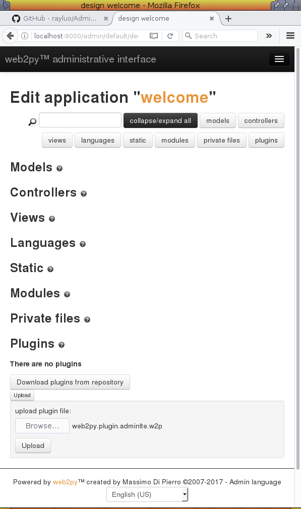

web2py plugin AdminLTE
======================

This is a layout plugin based on [AdminLTE](https://adminlte.io/).
It is designed to be used in [web2py](http://web2py.com) applications only.

How to use it
-------------

1. You create your own web2py app
   [as usual](http://www.web2py.com/books/default/chapter/29/03/overview#Simple-examples)

2. Download the `web2py.plugin.adminlte.w2p` package from this plugin's
   [github release page](https://github.com/rayluo/plugin_adminlte/releases),
   and then upload it via web2py's built-in admin interface.
   See the bottom of the following screenshot. 

3. Edit your app's `views/default/index.html`, `views/default/user.html`,
   or perhaps `views/generic.html` and/or any other `views/*/*.html`,
   find this line (it is usually the first): `{{extend 'layout.html'}}`,
   and replace it with: `{{extend 'plugin_adminlte/layout_starter.html'}}`.

OK. Run your app and you'll see a stunningly new look.

How to use the bleeding edge version (and contribute)
-----------------------------------------------------

Alternatively, if you want to also contribute to the development of this plugin,
you can somehow `git clone ` this repo and then link them into your web2py app,
that way you can make adjustments and later easily commit them and send out a PR.

Replace the second step above by this
(but note that this method is subject to change in the future):

    $ cd path/to/your/web2py/applications/your_app/views
    $ git clone https://github.com/rayluo/plugin_adminlte.git plugin_adminlte

You can also try to use `git submodule` to do similar thing,
but that part is outside of the scope of this essay.

ROADMAP
-------
* TBD: Reorganize the folder structure as `views/plugin_adminlte/*`
  so that this repo can potentially include
  `static/plugin_adminlte/*`, `modules/plugin_adminlte/*` in the future.
  (And then the alternative method mentioned above would also need to change.)

Note to project maintainer(s)
-----------------------------
In each release, you will have to manually pack this plugin via your web2py admin
and then upload it into github release page.
(The default version.tar.gz source package generated by github release contains
different folder structure, so it can NOT be used as a web2py plugin package.)

